# 2020JimmyWilson Digital Forensics Investigation


This repository documents a full forensic investigation performed on the forensic disk image `2020JimmyWilson.E01`. The investigation focused on browser artifact analysis, registry forensics, shellbag analysis, metadata extraction, evidence recovery, and user activity reconstruction using industry-standard digital forensic tools.

---

# Table of Contents

- [Project Overview](#project-overview)
- [Investigation Objectives](#investigation-objectives)
- [Forensic Environment](#forensic-environment)
- [Evidence Verification](#evidence-verification)
- [System Identification](#system-identification)
- [Browser Artifact Analysis](#browser-artifact-analysis)
- [Recovered Search Queries](#recovered-search-queries)
- [Recovered Web Activity](#recovered-web-activity)
- [Registry & Shellbag Analysis](#registry--shellbag-analysis)
- [Recovered Files](#recovered-files)
- [Credential Hardware Research](#credential-hardware-research)
- [Browser Cache Evidence](#browser-cache-evidence)
- [Document Metadata Analysis](#document-metadata-analysis)
- [Skills Demonstrated](#skills-demonstrated)
- [Lessons Learned](#lessons-learned)
- [Screenshots](#screenshots-folder)
- [Disclaimer](#disclaimer)

---

# Project Overview

| Category | Details |
|----------|----------|
| Project Name | 2020JimmyWilson Digital Forensics Investigation |
| Investigation Type | Digital Forensics & Artifact Analysis |
| Evidence Image | 2020JimmyWilson.E01 |
| Operating System | Windows |
| Tools Used | FTK Imager, Autopsy, Registry Explorer |
| Analysis Areas | Browser Artifacts, Registry, Shellbags, Metadata |
| Objective | Reconstruct user activity and identify suspicious behavior |

---

# Investigation Objectives

The primary objectives of this investigation were to:

- Verify forensic image integrity
- Identify system information
- Recover browser search activity
- Analyze evidence of identity theft research
- Investigate financial evasion activity
- Recover deleted or suspicious files
- Examine Shellbag and Registry artifacts
- Identify credential-printing hardware research
- Extract metadata from Microsoft Office documents
- Reconstruct user behavior from forensic artifacts

---

# Forensic Environment

| Component | Description |
|-----------|-------------|
| Analysis Workstation | Windows Environment |
| Primary Imaging Tool | FTK Imager |
| Primary Analysis Tool | Autopsy |
| Registry Analysis Tool | Registry Explorer |
| Evidence Format | Expert Witness Format (E01) |
| Artifact Sources | Browser History, Registry Hives, Shellbags, Cached Files |

---

# Evidence Verification

## Verified Hash Values

### MD5
```
b267fb0cd94645425eee00258d3a9b58
```

### SHA1
```
a1102c70a50768b588225fdcad6efa5d5d57341b
```

Hash verification confirmed the integrity of the forensic image prior to analysis.

---
### Screenshot
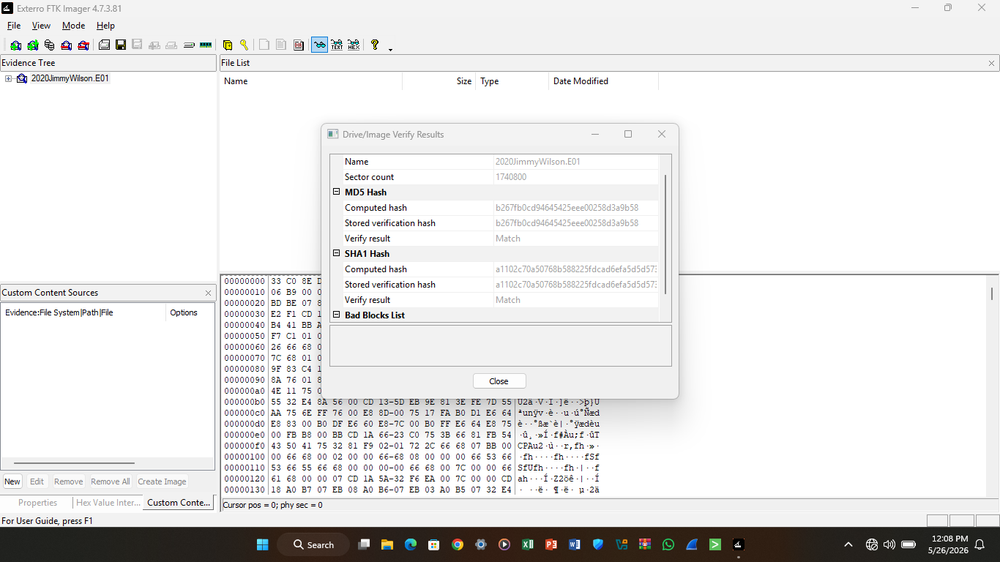

---

# System Identification

Analysis of the Windows SYSTEM Registry hive identified the workstation name as:
```
IACIS-HDD-2014
```
---

## Registry Key
```
ControlSet001\Control\ComputerName\ComputerName
```

---

### Screenshot
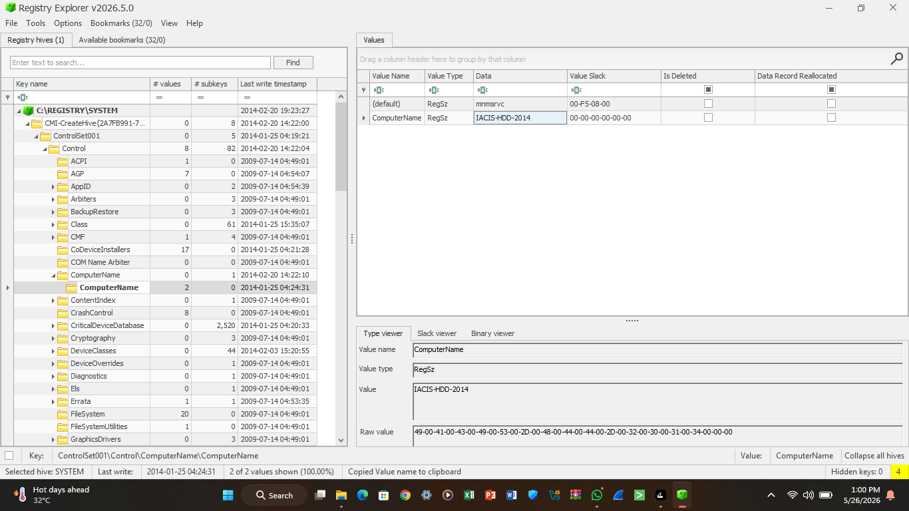

---

# Browser Artifact Analysis

Browser artifacts recovered from:
- Microsoft Edge
- Firefox
- Internet Explorer

revealed searches and webpage visits associated with:
- identity theft,
- disappearing without detection,
- financial concealment,
- fraud research,
- and firearms-related activity.

---

# Recovered Search Queries

## Bing Searches

```
how to disappear without a trace
```

```
how to steal identities
```

```
identity theft jail time
```

```
handguns
```

---

### Screenshot

<details>
  <summary>Click to view all Browser Search History screenshots</summary>
  
  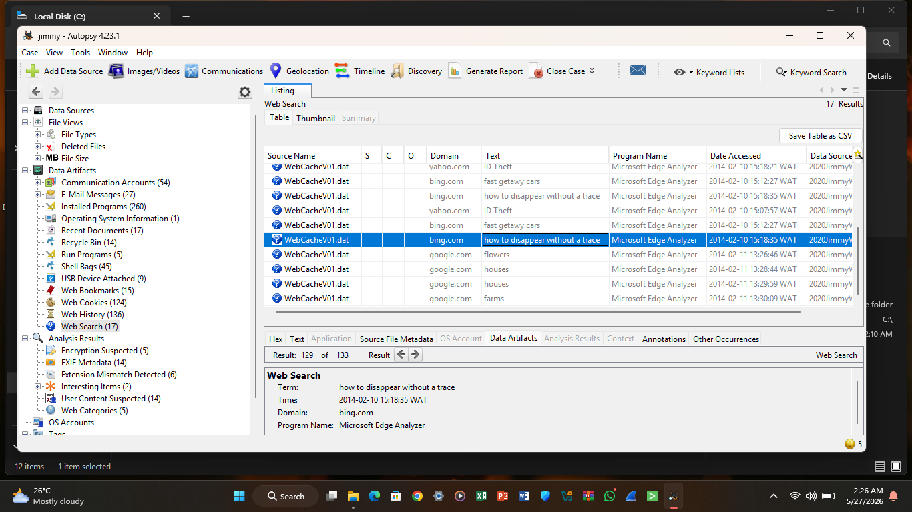
  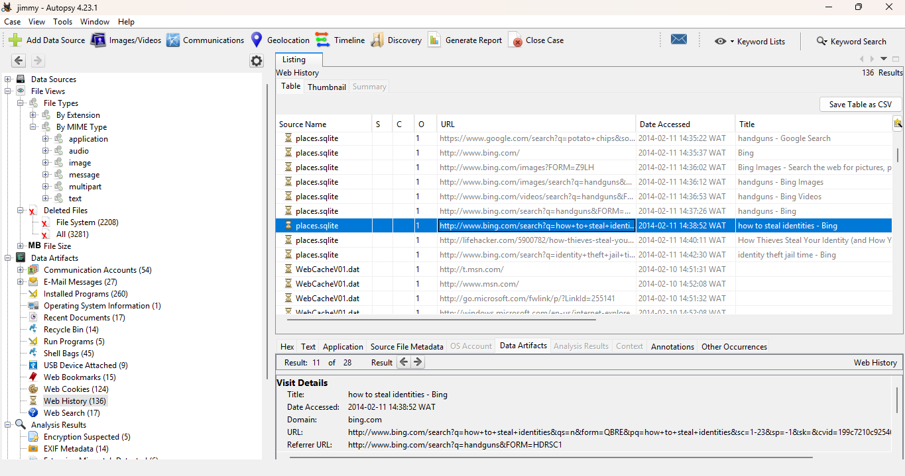
  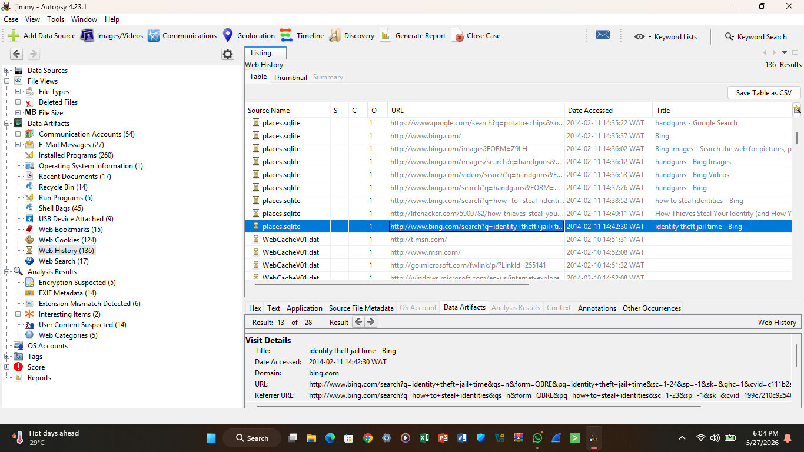
  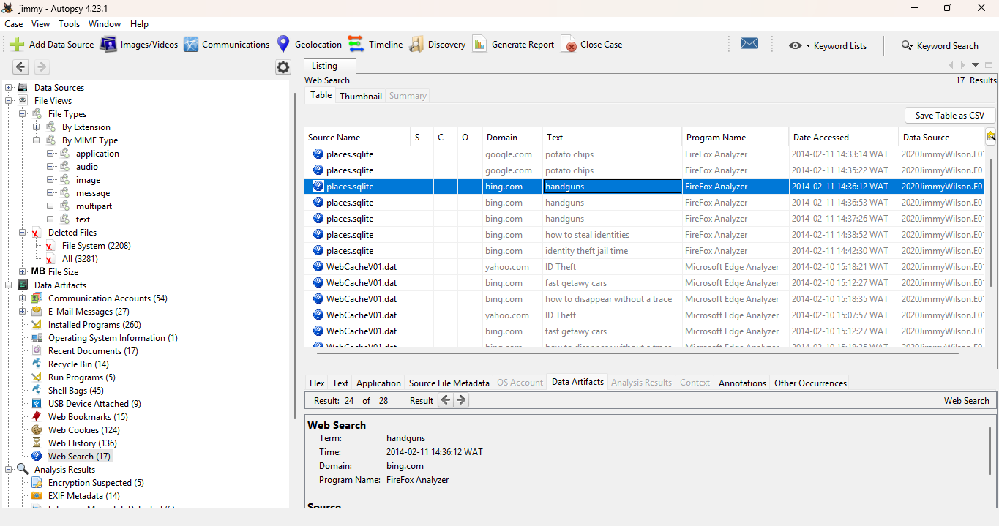
</details>

---

# Recovered Web Activity

## Lifehacker Article

Recovered browser history identified access to:

```
How to Ditch Big Brother and Disappear Forever
```

### URL
```
http://lifehacker.com/5676149/how-to-ditch-big-brother-and-disappear-forever
```

---

## Libertarian Money Article

Recovered artifacts also revealed access to:

```
How to Hide Money From The Government
```

### URL
```
http://libertarianmoney.wordpress.com/2013/05/29/how-to-hide-money-from-the-government/
```

---

## Department of Justice Webpage

```
http://www.justice.gov/criminal/fraud/websites/idtheft.html
```

---

### Screenshot
<details>
  <summary>Click to view all Browser Search History screenshots</summary>
  
  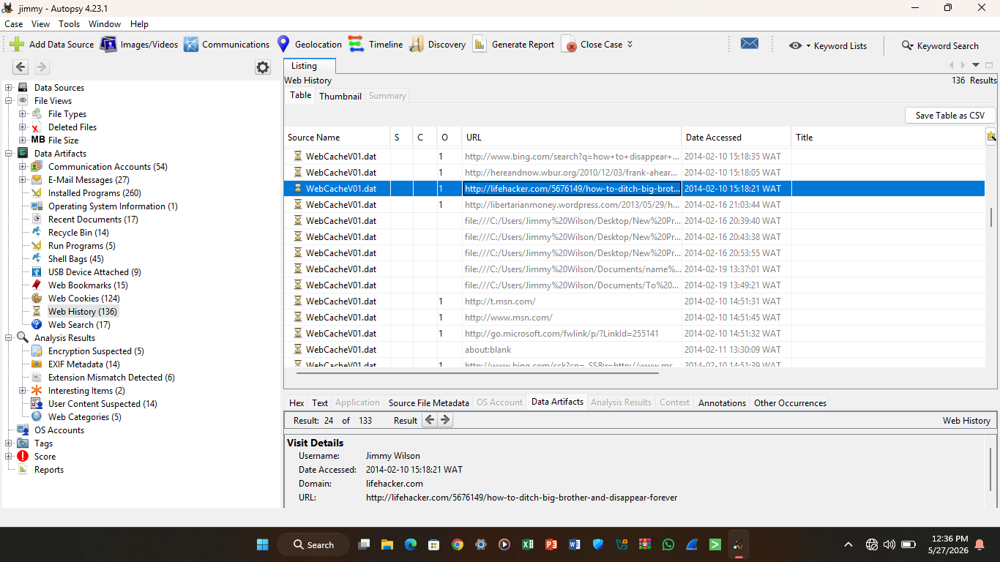
  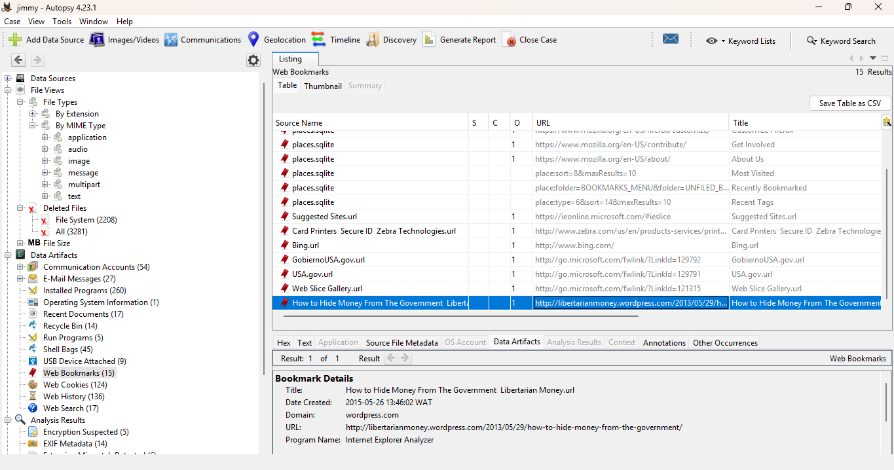
  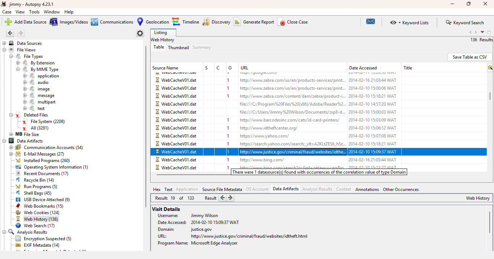
</details>

---

# Registry & Shellbag Analysis

Shellbag analysis revealed interaction with encrypted storage locations and suspicious folders.

## Recovered Artifact

```
My Computer\M:\Jimmy Wilson True Crypt
```

## Registry Path

```
Local Settings\Software\Microsoft\Windows\Shell\BagMRU\2\1\0\
```

These artifacts provided evidence of historical folder access even after deletion.

---

### Screenshot
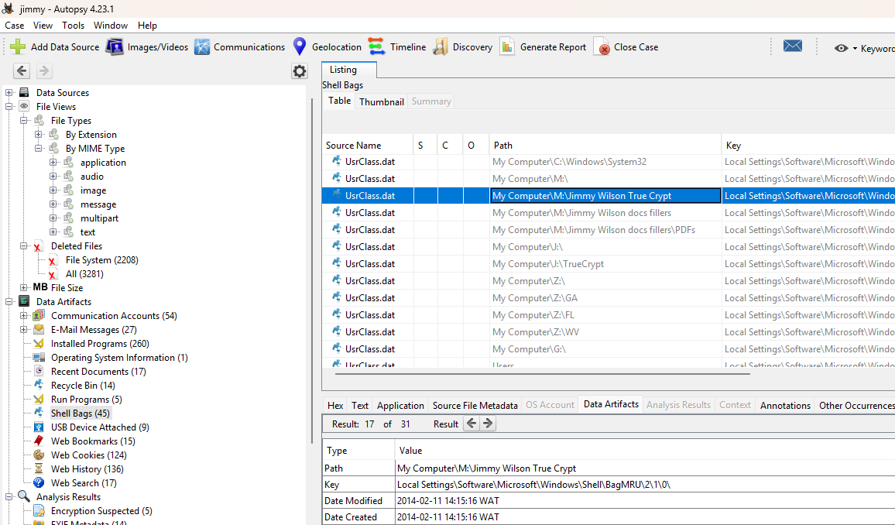

---

# Recovered Files

## Proprietary Data Artifact

Recovered file:

```
New Price List Encoded.TXT
```

### File Path

```
/img_2020JimmyWilson.E01/vol_vol6/$RECYCLE.BIN/S-1-5-21-1171287513-3642516788-2358256967-1004/$R3TS6GA/New Price List Encoded.TXT
```

---

### Screenshot Placeholder
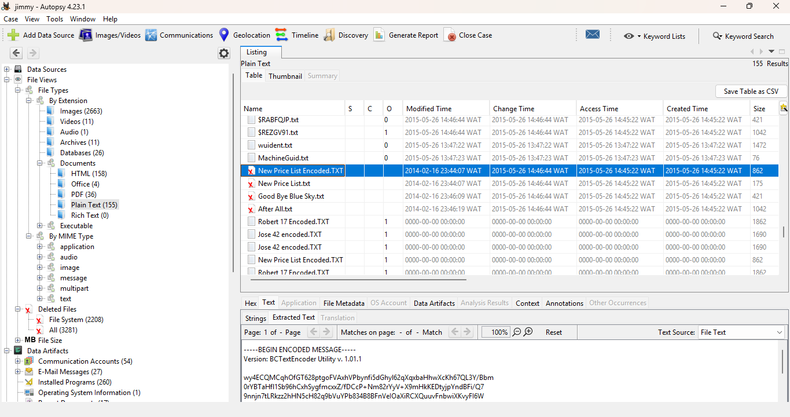

---

# Credential Hardware Research

Recovered documents revealed research into credential-printing hardware.

## Recovered PDF

```
zxp8-datasheet-en-us.pdf
```

## Hardware Identified

```
Zebra ZXP Series 8
```

The ZXP Series 8 is a professional-grade card printer commonly used for:
- employee badges,
- access cards,
- and identification credential production.

---

### Screenshot
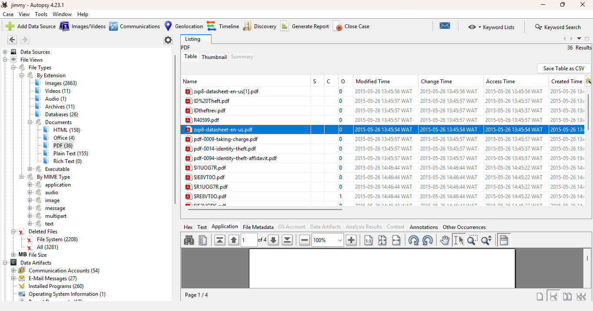

---

# Browser Cache Evidence

Browser cache artifacts identified images associated with:
- Zebra
- BarcodesInc

## Cached Image

```
Zebra[1].gif
```

## File Location

```
/img_2020JimmyWilson.E01/vol_vol6/USERS/Jimmy Wilson/AppData/Local/Microsoft/Windows/Temporary Internet Files/Low/Content.IE5/CBU4KX3T/Zebra[1].gif
```

---

### Screenshot
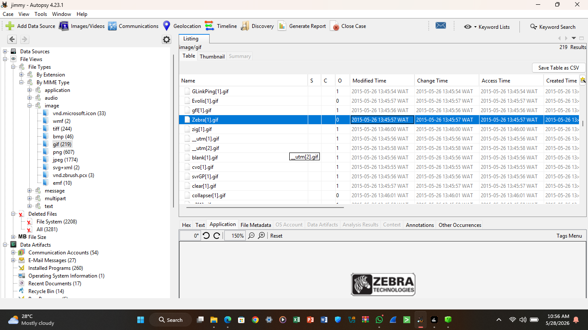

---

# Document Metadata Analysis

Metadata analysis was performed on recovered Microsoft Office documents.

## Examined Document

```
letterlegal5.doc
```

## Metadata Recovered

```
meta:last-author: Randy Prakken
```

This metadata identified:

```
Randy Prakken
```

as the last recorded author of the document.

---

### Screenshot
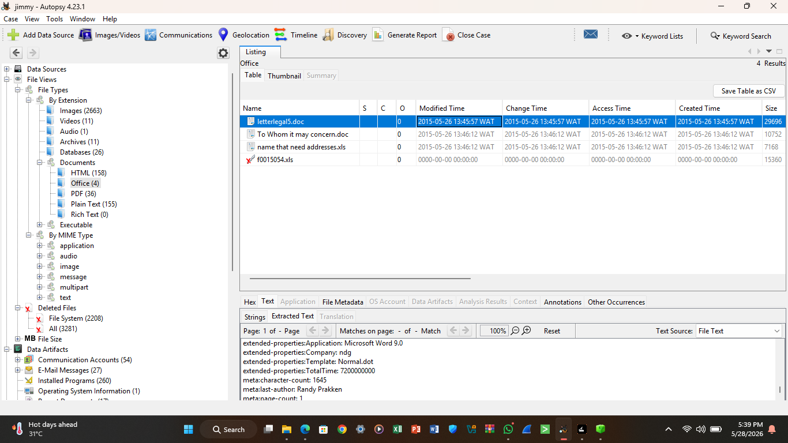

---

# Skills Demonstrated

- Digital Forensics
- Browser Artifact Analysis
- Windows Registry Analysis
- Shellbag Analysis
- Metadata Examination
- Timeline Reconstruction
- File Recovery
- Evidence Validation
- Incident Documentation
- Forensic Reporting

---

# Lessons Learned

This forensic investigation provided hands-on experience with:
- forensic image verification,
- artifact correlation,
- evidence preservation,
- behavioral reconstruction,
- and structured forensic reporting methodologies.

The assignment reinforced the importance of:
- maintaining evidence integrity,
- documenting findings thoroughly,
- and analyzing multiple artifact sources to reconstruct user activity.

---

# Screenshots Folder

| Screenshot | Description |
|------------|-------------|
| hash.png | FTK Imager hash verification |
| computer-name.png | SYSTEM hive computer name |
| search.png  search1.png  search2.png  search3.png | Browser search history evidence |
| disappear.png money.png justice.png  | Recovered suspicious webpage visits |
| shellbag.png | Shellbag registry artifact |
| recovered.png | Deleted/recovered files evidence |
| hardware.png | Zebra printer datasheet evidence |
| cache.png | Cached Zebra image artifact |
| metadata.png | Metadata showing last author |

---

# Disclaimer

This repository was created strictly for educational and training purposes within a controlled forensic analysis environment.

No malicious activity was performed or encouraged.
